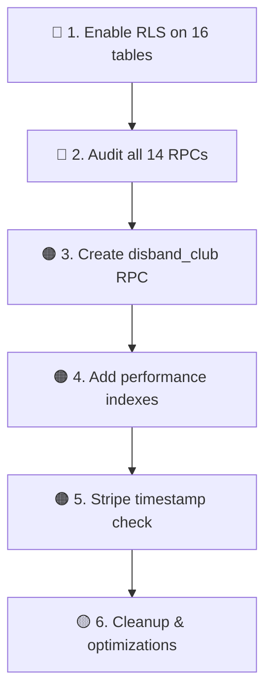

# DigiWell Backend Production Audit

**Date:** 2026-04-28  
**Scope:** Supabase RLS · RPCs · Edge Functions · Token Handling · Indexes · Query Performance · Cross-account Safety  
**Method:** Static analysis of all migration SQL, edge function source, and client-side `supabase.from()` / `supabase.rpc()` call sites.

---

## Executive Summary

The DigiWell backend has **6 well-secured domains** (social, water_logs, AI memory, storage, calendar proxy, Stripe) and **≈16 tables accessed by the client with no RLS definition in the tracked SQL files**. These represent the highest-priority risk for an App Store release.

| Severity | Count | Status |
|----------|-------|--------|
| 🔴 CRITICAL | 5 | Must fix before release |
| 🟠 HIGH | 7 | Should fix before release |
| 🟡 MEDIUM | 6 | Fix soon after release |
| 🟢 LOW / INFO | 4 | Improvement suggestions |

---

## 1. RLS Policy Safety

### Tables with confirmed RLS + Policies ✅

| Table | SELECT | INSERT | UPDATE | DELETE | Source |
|-------|--------|--------|--------|--------|--------|
| `profiles` | ✅ public | — | ✅ own | — | `social_lite.sql` |
| `water_logs` | ✅ own | ✅ own | ✅ own | ✅ own | `critical_backend_fixes.sql` |
| `social_posts` | ✅ visibility | ✅ own | ✅ own | ✅ own | `social_lite.sql` |
| `social_post_likes` | ✅ all auth | ✅ own | — | ✅ own | `social_lite.sql` |
| `social_follows` | ✅ all auth | ✅ own | — | ✅ own | `social_lite.sql` |
| `ai_conversations` | ✅ own | ✅ own | ✅ own | ✅ own | `ai_memory.sql` |
| `ai_messages` | ✅ own+conv | ✅ own+conv | ✅ own+conv | ✅ own+conv | `ai_memory.sql` |
| `storage:social-media` | ✅ public | ✅ own folder | ✅ own folder | ✅ own folder | `social_lite.sql` |

### 🔴 CRITICAL — Tables accessed by client with NO RLS in tracked SQL

> [!CAUTION]
> These tables are accessed by client-side Supabase queries. If RLS is not enabled on these tables in the actual database (e.g., via Dashboard or untracked SQL), **any authenticated user can read/modify any row**.

| # | Table | Client Operations | Risk |
|---|-------|-------------------|------|
| C1 | `hydration_battles` | INSERT, UPDATE, SELECT | Any user can modify anyone's battles |
| C2 | `clubs` | SELECT all, DELETE by owner | Any user can delete any club |
| C3 | `club_members` | SELECT, INSERT, DELETE | Any user can join/kick from any club |
| C4 | `club_messages` | INSERT, SELECT (realtime) | Any user can read/write to any club chat |
| C5 | `club_activity` | INSERT, DELETE, SELECT | Any user can inject fake activity |

### 🟠 HIGH — Tables accessed by client with NO RLS

| # | Table | Client Operations | Risk |
|---|-------|-------------------|------|
| H1 | `notifications` | UPDATE `is_read`, INSERT | User A can mark User B's notifications as read |
| H2 | `reports` | INSERT | Low — but no ownership check on reporter_id |
| H3 | `saved_posts` | INSERT, DELETE | User can delete others' saved posts |
| H4 | `social_comments` / `social_post_comments` | INSERT, DELETE | User can delete anyone's comments |
| H5 | `user_quests` | INSERT, UPDATE | User can manipulate quest progress |
| H6 | `user_challenges` | SELECT, INSERT | User can join challenges as another user |
| H7 | `user_purchases` | SELECT | User can see other users' purchases |

### 🟡 MEDIUM — Reference tables possibly without RLS

| # | Table | Access Pattern | Risk |
|---|-------|----------------|------|
| M1 | `badges` | SELECT all | Read-only — low risk if table is public |
| M2 | `user_badges` | SELECT, INSERT | User could award badges to themselves |
| M3 | `shop_items` | SELECT where `is_active` | Read-only — low risk |
| M4 | `challenges` | SELECT | Read-only — low risk |
| M5 | `quests` | SELECT | Read-only — low risk (dev seed only) |
| M6 | `ai_reports` | INSERT | User can insert reports for other users |
| M7 | `club_admin_logs` | SELECT, INSERT | No ownership check |
| M8 | `club_daily_stats` | DELETE | No ownership check |
| M9 | `friends` | SELECT count | Possibly leaking friend counts |

### 🔴 CRITICAL — `profiles` table missing INSERT + DELETE policies

The `profiles` table has **no INSERT policy** in any tracked SQL file. The `profile.service.ts` calls `supabase.from('profiles').upsert(...)`. Without an INSERT policy, new users cannot self-register their profile. This likely works today because:
- Either a Supabase trigger handles it, or
- An INSERT policy exists in the dashboard but not in tracked SQL

**Also missing:** No DELETE policy for profiles, which is needed for GDPR account deletion.

---

## 2. RPC Security

### RPCs with confirmed `auth.uid()` validation ✅
| RPC | Auth Check | `SECURITY DEFINER` | `SET search_path` |
|-----|-----------|--------------------|--------------------|
| `use_streak_freeze` | ✅ `auth.uid() <> p_user_id` → exception | ✅ | ✅ `= public` |

### 🟠 HIGH — RPCs called by client with NO tracked SQL definition

> [!WARNING]
> These RPCs are invoked from client code but have **no SQL definition in tracked migration/schema files**. Their security posture is unknown without inspecting the live database.

| RPC | Caller(s) | Concern |
|-----|-----------|---------|
| `delete_user_account` | `SettingsModal`, `profile.service` | **Must** have `SECURITY DEFINER` + `auth.uid()` check. If it uses service role without checking the caller, any user could delete any account. |
| `process_hydration_event` | `useWaterData`, `useSmartBottle` | Called with `p_user_id` — must validate `auth.uid() = p_user_id` |
| `log_water_and_update_streak` | `gamification.ts` | Called with `p_user_id` — must validate caller |
| `award_exp_and_rank` | `questEngine`, `GachaMachine` | Called with `p_user_id` — a malicious client could award EXP to self |
| `action_cheers_post` | `FeedTab` | Creates water for `p_author_id` — must validate caller |
| `pulse_post` | `FeedTab` | Increments pulse count — should rate-limit |
| `purchase_item` | `shop.service` | Deducts WP — **must** validate `auth.uid() = p_user_id` |
| `claim_quest_reward` | `questEngine` | Awards WP — must validate ownership |
| `claim_challenge_reward` | `questEngine` | Awards WP — must validate ownership |
| `join_challenge` | `useGamification`, `ChallengesList` | Must prevent double-join |
| `resolve_stale_battle` | `useBattleArena` | Must validate participant |
| `assign_daily_quests` | `usePremiumGamification` | Must validate caller |
| `increment_club_member_intake` | `useWaterData` | Must validate club membership |
| `get_club_level` | `ClubDashboard` | Read-only — lower risk |

### Recommended RPC Audit Checklist

For every RPC above, verify:
```sql
-- ✅ Required pattern for all user-facing RPCs
CREATE OR REPLACE FUNCTION public.my_rpc(p_user_id uuid, ...)
RETURNS ... LANGUAGE plpgsql
SECURITY DEFINER
SET search_path = public
AS $$
BEGIN
  IF auth.uid() IS NULL OR auth.uid() <> p_user_id THEN
    RAISE EXCEPTION 'Unauthorized';
  END IF;
  -- ... business logic ...
END;
$$;
```

---

## 3. Edge Function Security

### `ai-gateway` ✅ Secure
- ✅ JWT authentication via `supabase.auth.getUser()`
- ✅ No service role key used (user-scoped client)
- ✅ Input validation on actions
- ✅ Groq API key never exposed to client
- ✅ Water action clamping (30–2000ml, factor -1 to 1.5)
- 🟡 CORS `Access-Control-Allow-Origin: *` — acceptable for mobile app, but tighten for web

### `calendar-proxy` ✅ Secure (with caveats)
- ✅ JWT authentication
- ✅ Token resolution is server-side only
- ✅ Graceful `needs_reauth` fallback
- ✅ No tokens leaked to client
- 🟡 `extractGoogleIdentityTokens()` (L63-78) is **dead code** — always returns `{ null, null }`. Should be removed.
- 🟡 Admin API fallback (L132-161) reads `raw_app_meta_data.provider_refresh_token` — this field may not exist in all Supabase versions. Add null-safety logging.

### `create-stripe-checkout` ✅ Secure
- ✅ JWT authentication
- ✅ Uses `user.id` (not client-provided `userId`) for `client_reference_id` — **good**, prevents impersonation
- ✅ Stripe secret never exposed
- 🟡 Client sends `userId` in body (L9) but it's **unused** — the function correctly uses `user.id` from JWT. The `userId` field in the request type should be removed to avoid confusion.

### `stripe-webhook` ✅ Secure
- ✅ HMAC-SHA256 signature verification with timing-safe compare
- ✅ Uses `SUPABASE_SERVICE_ROLE_KEY` (correct for webhooks)
- ✅ Handles checkout.session.completed, subscription.updated/deleted
- 🟠 **Missing timestamp validation**: The webhook doesn't check if `timestamp` is within tolerance (typically ±5min). A replayed webhook with a valid old signature could be re-processed.

---

## 4. Token Handling

### Client-side ✅ Clean
- ✅ No Google OAuth tokens stored in client storage (purged in previous session)
- ✅ `purgeLegacySensitiveStorage()` cleans old tokens on boot
- ✅ `useCalendarSync` only calls Edge Function, never touches raw tokens

### Server-side ✅ Correct pattern
- ✅ `calendar-proxy` resolves tokens entirely server-side
- ✅ Stripe keys only in Edge Function env vars
- ✅ Groq API key only in Edge Function env vars

### 🟡 Improvement: Supabase ANON key exposure
- The `SUPABASE_ANON_KEY` is inherently public (it's in the client bundle). This is by design, but ensure all security relies on RLS policies, not key secrecy.

---

## 5. Missing Indexes

### Confirmed indexes ✅
| Table | Index | Columns |
|-------|-------|---------|
| `social_follows` | ✅ | `following_id` |
| `social_posts` | ✅ | `(author_id, created_at DESC)` |
| `social_posts` | ✅ | `(post_kind, expires_at)` |
| `social_post_likes` | ✅ | `user_id` |
| `ai_conversations` | ✅ | `(user_id, created_at DESC)` |
| `ai_messages` | ✅ | `(conversation_id, created_at ASC)` |
| `ai_messages` | ✅ | `(user_id, created_at DESC)` |

### 🟠 HIGH — Missing indexes (will cause slow queries at scale)

| # | Table | Missing Index | Query Pattern | Impact |
|---|-------|---------------|---------------|--------|
| I1 | `water_logs` | `(user_id, day)` | `WHERE user_id = ? AND day::text = ?` — used in `use_streak_freeze` and ClubsView | Full table scan per user per day lookup |
| I2 | `water_logs` | `(user_id, created_at DESC)` | ClubsView fetches all logs ordered by `created_at` | Full scan on large tables |
| I3 | `hydration_battles` | `(challenger_id)` and `(opponent_id)` | `.or('challenger_id.eq.X,opponent_id.eq.X')` | Sequential scan |
| I4 | `notifications` | `(recipient_id, is_read)` | `UPDATE ... WHERE recipient_id = ? AND is_read = false` | High frequency operation |
| I5 | `club_members` | `(club_id, user_id)` | `.match({ club_id, user_id })` for kick/role changes | Compound key lookup |
| I6 | `user_quests` | `(user_id, status)` | Filtered fetch per user | Required for quest dashboard |
| I7 | `user_challenges` | `(user_id, status)` | `.eq('user_id', userId).eq('status', 'joined')` | Per-user filter |

### Proposed Migration

```sql
-- Performance indexes for production scale
CREATE INDEX CONCURRENTLY IF NOT EXISTS idx_water_logs_user_day
  ON public.water_logs (user_id, day);

CREATE INDEX CONCURRENTLY IF NOT EXISTS idx_water_logs_user_created
  ON public.water_logs (user_id, created_at DESC);

CREATE INDEX CONCURRENTLY IF NOT EXISTS idx_hydration_battles_challenger
  ON public.hydration_battles (challenger_id, created_at DESC);

CREATE INDEX CONCURRENTLY IF NOT EXISTS idx_hydration_battles_opponent
  ON public.hydration_battles (opponent_id, created_at DESC);

CREATE INDEX CONCURRENTLY IF NOT EXISTS idx_notifications_recipient_unread
  ON public.notifications (recipient_id, is_read) WHERE is_read = false;

CREATE INDEX CONCURRENTLY IF NOT EXISTS idx_club_members_club_user
  ON public.club_members (club_id, user_id);

CREATE INDEX CONCURRENTLY IF NOT EXISTS idx_user_quests_user_status
  ON public.user_quests (user_id, status);

CREATE INDEX CONCURRENTLY IF NOT EXISTS idx_user_challenges_user_status
  ON public.user_challenges (user_id, status);
```

---

## 6. Query Performance

### 🟠 HIGH — Client-side full-table deletions

> [!WARNING]
> `ClubDashboard.tsx` (L238-244) performs **cascading client-side deletions** for club disbanding:
> ```ts
> await supabase.from('club_activity').delete().eq('club_id', club.id);
> await supabase.from('club_messages').delete().eq('club_id', club.id);
> await supabase.from('club_daily_stats').delete().eq('club_id', club.id);
> await supabase.from('club_members').delete().eq('club_id', club.id);
> await supabase.from('clubs').delete().eq('id', club.id);
> ```
> **Problems:**
> 1. Not atomic — if step 3 fails, data is left in inconsistent state
> 2. No authorization — relies on (missing) RLS
> 3. Performance — 5 sequential round trips
>
> **Fix:** Create a `disband_club(p_club_id uuid)` server-side RPC with a single transaction and ownership check.

### 🟡 MEDIUM — N+1 patterns

- `useBattleArena.ts` L91-93: Loops through `pendingInvites` and calls `supabase.from('hydration_battles').update(...)` per invite. Should batch into a single `.in('id', ids)` call.

### 🟡 MEDIUM — `use_streak_freeze` day casting

```sql
AND day::text = v_yesterday;
```
This casts `day` to text for comparison. If `day` is already a `date` type, use:
```sql
AND day = v_yesterday::date;
```
This enables index usage on the `day` column.

---

## 7. Cross-Account Data Leakage Risks

### 🔴 CRITICAL — Battle Arena leaks all user profiles

```ts
// useBattleArena.ts L51
const { data: users } = await supabase
  .from('profiles')
  .select('id, nickname, level, avatar_url')
  .neq('id', profile.id)
  .limit(10);
```
The `profiles` table has `SELECT` open to all authenticated users (by design for social features). However, this query returns **random** users as potential opponents. This is acceptable for the game mechanic but be aware it exposes `nickname`, `level`, and `avatar_url` of arbitrary users.

### 🟠 HIGH — Comment deletion scope

```ts
// FeedTab.tsx L553
const { error } = await supabase
  .from('social_comments')
  .delete()
  .eq('id', commentId);
```
Without RLS on `social_comments`, **any authenticated user can delete any comment** by providing its UUID. The client-side guard (L595: checking `c.user_id === currentUserId || post.author_id === currentUserId`) is purely cosmetic — it only hides the button, not the capability.

### 🟠 HIGH — Notification manipulation

```ts
// useNotifications.ts L72
await supabase.from('notifications')
  .update({ is_read: true })
  .eq('recipient_id', currentUserId)
  .eq('is_read', false);
```
If `notifications` has no RLS, the `.eq('recipient_id', currentUserId)` is the **only** protection, and it comes from the client. A modified client could pass any `recipient_id`.

---

## 8. Production Readiness Checklist

### Must Have Before App Store ❌

| # | Item | Status | Action |
|---|------|--------|--------|
| 1 | RLS on all 16+ unprotected tables | ❌ | Add `ALTER TABLE ... ENABLE RLS` + policies for every table in §1 |
| 2 | Validate `auth.uid()` in all 14 RPCs | ❓ | Audit each RPC in live DB; add guard if missing |
| 3 | Replace client-side club disbanding with RPC | ❌ | Create `disband_club()` RPC |
| 4 | Add critical indexes (water_logs, notifications, battles) | ❌ | Run §5 migration |
| 5 | Remove dead `extractGoogleIdentityTokens` | ❌ | Clean up calendar-proxy |
| 6 | Add Stripe webhook timestamp validation | ❌ | Check `timestamp` within ±300s |

### Should Have ⚠️

| # | Item | Status |
|---|------|--------|
| 7 | Rate limiting on `action_cheers_post` / `pulse_post` | ❌ |
| 8 | Remove `userId` from `CheckoutRequest` type | ❌ |
| 9 | Batch battle decline updates | ❌ |
| 10 | `delete_user_account` RPC SQL in version control | ❌ |

### Already Solid ✅

| # | Item |
|---|------|
| ✅ | JWT authentication on all 4 Edge Functions |
| ✅ | Stripe webhook HMAC verification |
| ✅ | No client-side OAuth token storage |
| ✅ | `use_streak_freeze` is fully atomic with auth check |
| ✅ | Social tables (posts, likes, follows) have complete RLS |
| ✅ | AI memory has double-lock RLS (user_id + conversation ownership) |
| ✅ | Storage bucket has folder-scoped upload policies |
| ✅ | Water logs have full CRUD RLS |

---

## Priority Fix Order



> [!IMPORTANT]
> **Items 1 and 2 are the most critical.** Without RLS on tables like `hydration_battles`, `clubs`, `club_members`, `notifications`, and `user_quests`, any authenticated user can manipulate any other user's data with a modified API call. This is a **store rejection risk** and a **user data safety issue**.

> [!TIP]
> If some tables already have RLS enabled via the Supabase Dashboard (but not in tracked SQL), export those policies to version-controlled migrations immediately. Untracked security config is a deployment risk.
